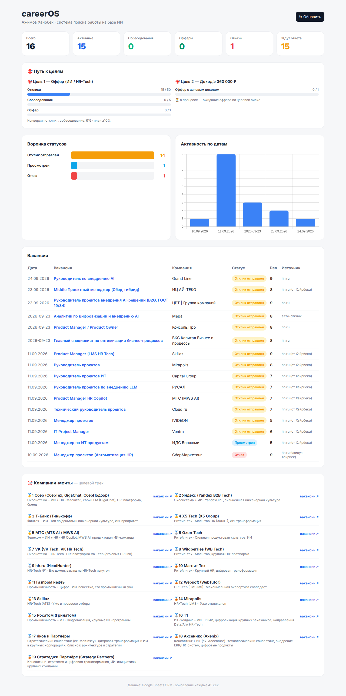
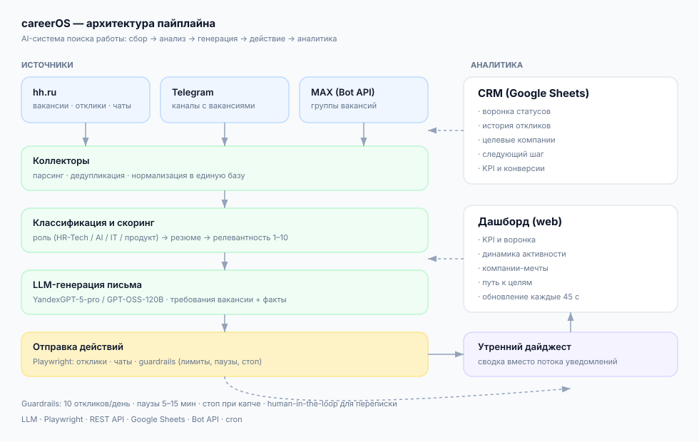

# careerOS

**Персональная операционная система поиска работы на базе ИИ.**

Мультиканальный пайплайн, который собирает вакансии из разных источников, оценивает
релевантность, генерирует персонализированные сопроводительные письма, отправляет
отклики, ведёт переписку с работодателями и показывает прогресс в реальном времени.

Проект демонстрирует **практическое применение LLM и AI-агентов** к реальной
бизнес-задаче: не «чат с нейросетью», а законченный продукт с данными, метриками
и автоматизацией.

---



### Архитектура



---

## Задача

Поиск работы — это фрагментированный процесс: вакансии разбросаны по hh.ru, Telegram-каналам
и мессенджерам; отклики пишутся руками; статусы теряются; нет понимания, что работает,
а что нет. careerOS превращает его в **управляемую систему с метриками**.

## Что делает система

| Блок | Функция |
|------|---------|
| **Сбор** | Вакансии из Telegram-каналов, мессенджера MAX и hh.ru (включая «Избранное») |
| **Нормализация** | Единая база: компания, должность, требования, ссылка, источник |
| **Классификация** | Определение роли (HR-Tech / AI / IT-проекты / продукт) по описанию |
| **Скоринг** | Оценка релевантности 1–10, отсев нерелевантного |
| **Генерация писем** | LLM пишет сопроводительное под требования конкретной вакансии |
| **Авто-отклики** | Playwright-автоматизация hh.ru с предохранителями |
| **Переписка** | Чтение входящих и отправка ответов в чатах hh (chatik) |
| **CRM** | Google Sheets: воронка статусов, история, следующий шаг |
| **Дашборд** | Веб-панель: KPI, воронка, динамика, целевые компании, трек целей |
| **Дайджест** | Ежедневная сводка вместо потока уведомлений |

## Архитектура

```
┌─────────────────────── ИСТОЧНИКИ ────────────────────────┐
│  Telegram-каналы   │   MAX (Bot API)   │   hh.ru          │
└──────────┬──────────┴─────────┬─────────┴────────┬────────┘
           ▼                    ▼                  ▼
        ┌──────────────── Коллекторы ────────────────┐
        │  парсинг, дедупликация, извлечение вакансий │
        └───────────────────┬────────────────────────┘
                            ▼
        ┌──────── Классификация и скоринг (роли) ─────┐
        │  роль → нужное резюме → приоритет           │
        └───────────────────┬─────────────────────────┘
                            ▼
        ┌──────── LLM-генерация письма (YandexGPT) ───┐
        │  требования вакансии + факты → письмо       │
        └───────────────────┬─────────────────────────┘
                            ▼
        ┌──── Отправка отклика (Playwright + hh) ─────┐
        │  предохранители: лимит/день, паузы, стоп     │
        └───────────────────┬─────────────────────────┘
                            ▼
        ┌──────── CRM (Google Sheets) + Дашборд ──────┐
        │  воронка · KPI · целевые компании · цели     │
        └──────────────────────────────────────────────┘
```

## Стек

- **Язык:** Python 3.11
- **Автоматизация браузера:** Playwright (Chromium, headless)
- **LLM:** YandexGPT-5-pro, GPT-OSS-120B (OpenAI-совместимый API)
- **Данные:** Google Sheets API (CRM), JSON-буферы
- **Дашборд:** Python http.server + HTML/Tailwind/Chart.js
- **Оркестрация:** cron (расписания), guardrails (лимиты/паузы)
- **Интеграции:** hh.ru (веб), MAX Bot API, Telegram, Google Workspace

## Ключевые инженерные решения

1. **Human-in-the-loop vs автоматизация.** Выбран режим «авто с предохранителями»:
   отклики отправляются автоматически, но с жёсткими лимитами (10/день, паузы 5–15 мин,
   стоп при капче). Переписка с работодателями — под контролем.
2. **LLM вместо шаблонов.** Персонализация письма под требования вакансии даёт
   заметно более высокий отклик, чем единый шаблон.
3. **Мультиканальность.** Один пайплайн на разные источники (hh, TG, MAX) — единая база
   и единая воронка.
4. **Анти-детект.** Человекоподобное поведение, рандомные паузы, лимиты — чтобы не
   спровоцировать защиту платформы.
5. **Обезличивание PII.** Персональные данные — только в рабочем контуре; аналитика
   строится на обезличенных данных (152-ФЗ).

## Структура репозитория

```
careerOS/
├── dashboard/          # веб-дашборд (server.py + index.html)
├── scripts/            # пайплайн: сбор, скоринг, генерация, отправка, CRM
├── docs/               # методика откликов и KPI
├── config/             # примеры конфигов (без секретов)
└── README.md
```

## Результаты (реальные данные)

| Метрика | Значение |
|---------|----------|
| Источников вакансий | **3** (hh.ru, Telegram, MAX) |
| Собрано вакансий | **300+** (MAX: 293 уникальных из 429 сообщений; hh «Избранное»: 20) |
| Откликов отправлено | **16+** (с персонализированными письмами) |
| Собеседований | **1** (переписка с рекрутёрами — активная) |
| Ручной труд | Сбор, скоринг, генерация писем, отклики, чтение/отправка сообщений, CRM, дашборд — автоматизированы |
| Экономия времени | ~25 мин на отклик → **~1 мин**, то есть **~25×** |

## Что демонстрирует проект

- Проектирование **AI-агентных пайплайнов** под реальную задачу
- Работу с **LLM API** и промпт-инжиниринг (генерация, персонализация, контроль фактов)
- **Интеграции**: Playwright-автоматизация, REST API, Google Workspace, Bot API
- **Продуктовое мышление**: метрики, воронка, KPI, дашборд, целевой трек
- **Инженерную зрелость**: guardrails, обработка ошибок, идемпотентность, логирование
- **ИБ-грамотность**: разграничение доступа, PII, 152-ФЗ

---

*Проект развивается как личный инструмент и портфолио-кейс.*
